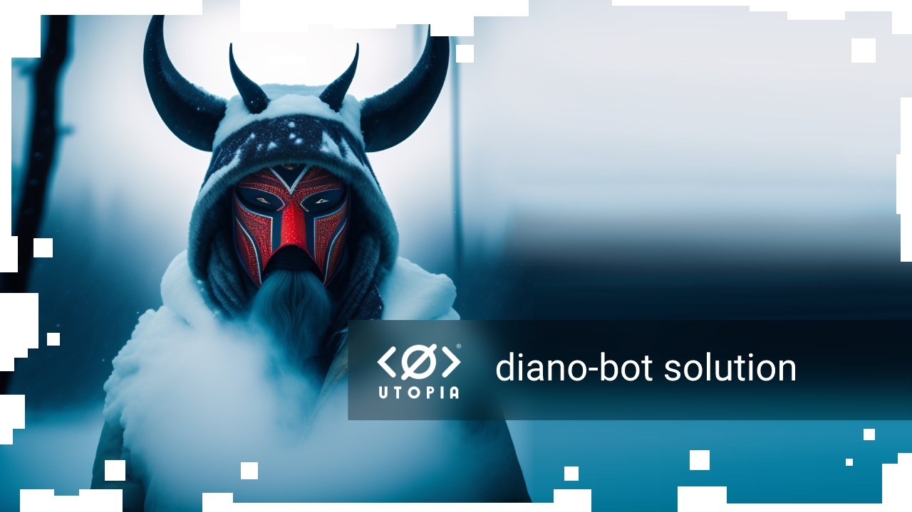

This bot allows you to periodically copy content from one messenger to another.

Supported Clients:

* [Telegram](https://telegram.org/);
* [Utopia](https://u.is/).

## Requirements

* Docker 2.2+

## How to run

1. Install [Utopia Messenger](https://u.is/en/download.html), create account file with password `password`.

2. Copy the repository or download it as a zip file:

```bash
git clone https://github.com/Sagleft/diano-bot && cd diano-bot
```

3. Put Utopia account file in the bot repository directory. Name a file `account.db`

4. Make changes to the config file `docker-compose.yml`

* `CRON_SPEC` - determines how often to post in the channels. Example: `every 1m`, `every 1h`

or a cron setting of the kind: `<Minute> <Hour> <Day_of_the_Month> <Month_of_the_Year> <Day_of_the_Week>`

example:

`0 2 * * *` - schedule a cron to execute at 2 am daily.

5. Install docker-compose if it is not already on the system.

Examples:

* [How To Install and Use Docker Compose on Ubuntu 20.04](https://www.digitalocean.com/community/tutorials/how-to-install-and-use-docker-compose-on-ubuntu-20-04)

6. Create content redirects

To create a new redirect contents task create a .json file in the `redirects` folder.

For example, 'export_NationGeographic.json'.

Content example:

```
{
	"source": {
		"tag": "telegram",
		"channelid": "NationGeographic"
	},
	"destination": {
		"tag": "utopia",
		"channelid": "02FAD8A273A72241F2D5B725742B53B0"
	},
	"params": {
		"limit": 1
	}
}
```

7. then run the command in the terminal to run bot:

```bash
docker-compose up
```

or run in background:

```bash
docker-compose up -d
```

## How to find bot logs

```bash
docker container logs diano-bot_core_1
```

where
* `tag`: technical parameter, messenger name;
* `channelid`: channel or group ID in the messenger;
* `source` section: where do we get the posts;
* `destination` section: where we will post posts;
* `params` section: other parameters;
* `limit`: number of posts for transportation;

## Solve problems

### Channel Limit Problem

In Utopia, you can create a maximum of 10 channels. There is a way to solve this problem. You will need to create additional accounts on which you will create channels. Next, you add the bot account to these channels and give it moderator rights.

### SSL problem

Get the correct directory for your certs to be placed by default with this

```bash
php -r "print_r(openssl_get_cert_locations()['default_cert_file']);"
```

Then use this to get the cert and put it in the default location found from the code above

```bash
wget http://curl.haxx.se/ca/cacert.pem -O <default location>
```

example:

```bash
wget http://curl.haxx.se/ca/cacert.pem -O /etc/pki/tls/cert.pem --no-check-certificate
```

---

](https://t.me/+VIvd8j6xvm9iMzhi)

---
[](https://udocs.gitbook.io/utopia-api/)
